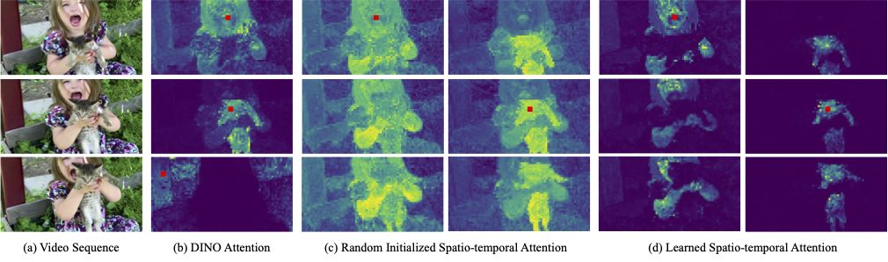
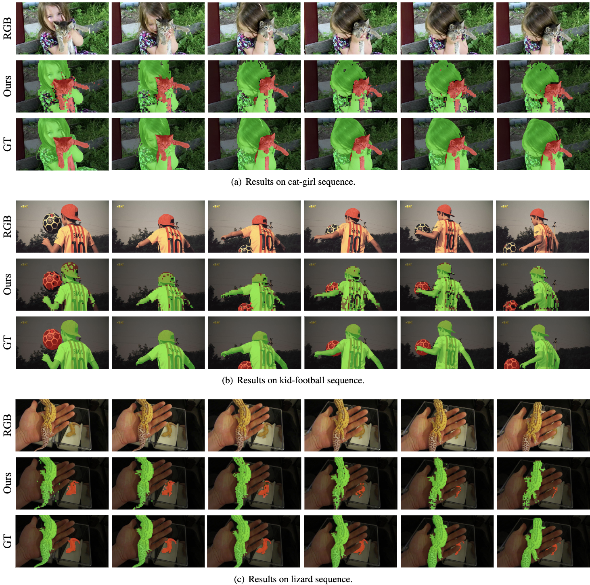

# Betrayed by Attention: A Simple yet Effective Approach for Self-supervised Video Object Segmentation
Official pytorch implementation of the paper [Betrayed by Attention: A Simple yet Effective Approach for Self-supervised Video Object Segmentation.](https://arxiv.org/abs/2109.15130)

## Overview
In this paper, we propose a simple yet effective approach for self-supervised video object segmentation (VOS). Our key insight is that the inherent structural dependencies present in DINO-pretrained Transformers can be leveraged to establish robust spatio-temporal correspondences in videos. Furthermore, simple clustering on this correspondence cue is sufficient to yield competitive segmentation results. We develop a simplified architecture that capitalizes on the emerging objectness from DINO-pretrained Transformers, bypassing the need for additional modalities or slot attention. Specifically, we first introduce a single spatio-temporal Transformer block to process the frame-wise DINO features and establish spatio-temporal dependencies in the form of self-attention. Subsequently, utilizing these attention maps, we implement hierarchical clustering to generate object segmentation masks. To train the spatio-temporal block in a fully self-supervised manner, we employ semantic and dynamic motion consistency coupled with entropy normalization. Our method demonstrates state-of-the-art performance across multiple unsupervised VOS benchmarks and particularly excels in complex real-world multi-object video segmentation tasks such as DAVIS-17-Unsupervised and YouTube-VIS-19.



[[Project Page]](https://mark12ding.github.io/project/CVPR22_FAME/) [[arXiv]](https://arxiv.org/abs/2109.15130) [[PDF]](https://mark12ding.github.io/project/CVPR22_FAME/asset/CVPR22_FAME.pdf)

## Usage

### Requirements
ToDo

### Data preparation
- Download the Kinetics400 dataset from the [official website](https://deepmind.com/research/open-source/kinetics).
- Download the UCF101 dataset from the [official website](https://www.crcv.ucf.edu/data/UCF101.php).


### Pretrain
In default, we train backbone I3D on K400 on a single node with 8 NVIDIA V100 gpus for 200 epochs. 
```python
python3 train.py \
  --log_dir $your/log/path \
  --ckp_dir $your/checkpoint/path \
  -a I3D \
  --dataset k400 \
  --lr 0.01  \
  -fpc 16 \
  -cs 224 \
  -b 64 \
  -j 128 \
  --cos \
  --epochs 200 \
  --dist-url 'tcp://localhost:10001' --multiprocessing-distributed --world-size 1 --rank 0 \
  $kinetics400/dataset/path
```

### Pretrained Model
I3D after pretrain on K400 [[google drive]](https://drive.google.com/file/d/1_-_yzR_esiY0IYKVYr_zjv7NlO43LcUL/view?usp=sharing)

I3D after finetune on UCF101 (Acc@1 88.9) [[google drive]](https://drive.google.com/file/d/10VuxFjEwH8P5wN1-3HeCkcN_wS76OQat/view?usp=sharing)

### Action Recognition Downstream Evaluation
In default, we finetune backbone I3D on UCF101 on a single node with 4 NVIDIA V100 gpus for 150 epochs.
```python
python3 eval.py \
  --log_dir $your/log/path \
  --pretrained $your/checkpoint/path \
  -a I3D \
  --seed 42 \
  --num_class 101 \
  --wd 1e-4 \
  --lr 0.025 \
  --weight_decay 0.0001 \
  --lr_decay 0.1 \
  -fpc 16 \
  -b 128 \
  -j 64 \
  -cs 224 \
  --finetune \
  --epochs 150 \
  --schedule 60 120 \
  --dist-url 'tcp://localhost:10001' --multiprocessing-distributed --world-size 1 --rank 0 \
  $ucf101/dataset/path
```
## Visualization
We visualize class-agnostic activation maps. FAME can well caputre the foreground motion while the baseline method fails.


## Acknowledgement
Our code is based on the implementation of [VideoMoCo](https://github.com/tinapan-pt/VideoMoCo) and [MoCo](https://github.com/facebookresearch/moco). We sincerely thanks those authors for their great works.


## Citation
If our code is helpful to your work, please consider citing:
```
@inproceedings{ding2022motion,
  title={Betrayed by Attention: A Simple yet Effective Approach for Self-supervised Video Object Segmentation},
  author={Ding, Shuangrui and Qian, Rui and Xu, Haohang and Lin, Dahua and Xiong, Hongkai},
  journal={arXiv preprint arXiv:xxxxxx},
  year={2022}
}
```


